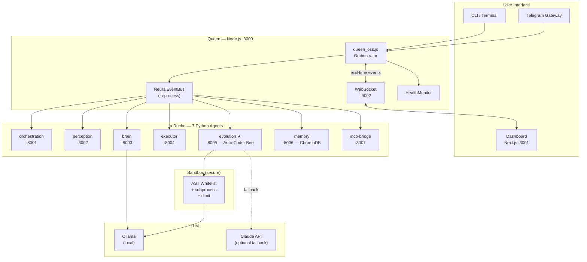

<div align="center">

# 🐝 Chimera — The Self-Coding Operating Environment

**A local-first, autonomous AI OS that turns natural language into running code.**

[](https://github.com/AMFbot-Gz/LaRuche/actions)
[](https://opensource.org/licenses/MIT)
[](https://www.python.org/downloads/)
[](https://nodejs.org/)
[](https://pnpm.io/)
[](https://ollama.ai/)

*100% local · 100% private · No API key required*

</div>

---

## What is Chimera?

Chimera is a **cognitive agentic OS** — give it a task in plain language, it writes the code, validates it in a secure sandbox, executes it, and saves the result as a reusable skill. No cloud, no subscriptions, no data leaving your machine.

```bash
# You say:
"Count all .py files modified in the last 7 days and sort by size"

# Chimera does:
#  1. Brain generates Python code via Ollama (local LLM)
#  2. Sandbox validates the AST against a security whitelist
#  3. Subprocess executes in isolation with resource limits
#  4. Result appears in your dashboard in real-time
#  5. Code is saved as a reusable skill
```

---

## Quick Start

**Prerequisites:** [Ollama](https://ollama.ai/), Node.js 20+, Python 3.11+, pnpm 9+

```bash
# 1. Clone
git clone https://github.com/AMFbot-Gz/LaRuche.git chimera && cd chimera

# 2. Configure
cp .env.example .env
# → Edit .env: set CHIMERA_SECRET and DASHBOARD_TOKEN (see file for instructions)

# 3. Pull a local LLM
ollama pull llama3.2:3b

# 4. Install all dependencies (JS + Python)
make install

# 5. Start everything
make dev
```

Open http://localhost:3001 → real-time dashboard ready.

---

## Architecture



---

## Key Concepts

### 🐝 Auto-Coder Bee (Evolution Agent — port :8005)

The core capability of Chimera. Receives a task description, generates Python code via a local LLM, validates it through AST analysis, executes it in a secure subprocess, and saves working code as a skill.

```
Description → LLMCodeGenerator → AST Sandbox → subprocess → SandboxResult → Skill saved
```

### 🏰 Queen Node.js

The central orchestrator. Routes commands from the CLI/Telegram/WebSocket to the right Python agent via the NeuralEventBus. Monitors all 7 agents' health.

### 🧠 NeuralEventBus

An in-process event bus with priority listeners, middleware pipeline, and security:
- Protected namespaces (`system.*`, `chimera.internal.*`)
- Rate limiting (500 events/s global)
- Payload validation (256 KB max)
- No payload data in history (prevents data leakage)

### 🔒 Sandbox Executor

Multi-layer defense for generated code:
1. **Import whitelist** — only 30 safe stdlib modules allowed
2. **AST analysis** — blocks `open`, `eval`, `exec`, `__builtins__`, etc.
3. **Subprocess isolation** — code runs in a separate process, not the main app
4. **Resource limits** — CPU time + memory via `rlimit`
5. **Minimal env** — hardcoded `PATH`, no `PYTHONPATH`/`LD_LIBRARY_PATH`

### 📊 Real-Time Dashboard

Next.js dashboard with Zustand state, live WebSocket connection, 3 widgets:
- **HiveStatus** — Queen + 7 agents health at a glance
- **LiveLogs** — event stream in real-time
- **QuickAction** — send missions directly from the browser

---

## Project Structure

```
chimera/
├── apps/
│   ├── queen/          # Node.js orchestrator (port :3000)
│   │   └── src/
│   │       ├── queen_oss.js         # Main entry point
│   │       ├── core/
│   │       │   └── consciousness/
│   │       │       └── neural_event_bus.js
│   │       └── services/
│   │           └── websocket_server.js
│   ├── dashboard/      # Next.js 15 dashboard (port :3001)
│   └── gateway/        # Multi-channel gateway (Telegram, Discord…)
├── agents/
│   ├── evolution/      # ★ Auto-Coder Bee (reference agent)
│   │   ├── auto_coder_bee.py         # FastAPI app :8005
│   │   ├── services/
│   │   │   ├── llm_code_generator.py # Ollama integration
│   │   │   └── sandbox_executor.py   # AST + subprocess sandbox
│   │   ├── schemas/
│   │   │   └── coding_task.py        # Pydantic models
│   │   └── tests/                    # 26 tests (pytest)
│   ├── orchestration/  # :8001 — multi-agent pipeline
│   ├── perception/     # :8002 — input parsing
│   ├── brain/          # :8003 — LLM planning + episodic memory
│   ├── executor/       # :8004 — system task execution
│   ├── memory/         # :8006 — ChromaDB vector store
│   └── mcp-bridge/     # :8007 — MCP protocol
├── skills/
│   ├── core/           # Built-in skills (screenshot, run_command…)
│   └── generated/      # Skills auto-generated by Bee
├── .env.example
├── Makefile
├── turbo.json
└── pyproject.toml
```

---

## Available Commands

```bash
make install      # Install all JS + Python dependencies
make dev          # Start Queen + Dashboard + all 7 agents
make queen        # Start Queen only (port :3000)
make dashboard    # Start Dashboard only (port :3001)
make agents-up    # Start all 7 Python agents
make agents-down  # Stop all Python agents
make test         # Run all tests (Node.js + Python)
make lint         # Run all linters (eslint + black + flake8)
```

---

## Running Tests

```bash
# Python (26 sandbox tests + agent tests)
uv run pytest agents/ -v

# Node.js
pnpm test

# All (via Turbo)
pnpm turbo run test
```

---

## Configuration

Copy `.env.example` to `.env` and set:

| Variable | Required | Description |
|----------|----------|-------------|
| `CHIMERA_SECRET` | **Yes** | WebSocket auth — `openssl rand -hex 32` |
| `DASHBOARD_TOKEN` | **Yes** | Dashboard WS auth — `openssl rand -hex 24` |
| `OLLAMA_HOST` | No | Default: `http://localhost:11434` |
| `OLLAMA_MODEL_CODE` | No | Default: `qwen3-coder` |
| `ANTHROPIC_API_KEY` | No | Optional Claude fallback |

---

## Security

Chimera was designed security-first from day one:

- **Sandbox whitelist** — import blacklists can be bypassed; our closed whitelist cannot
- **No timing attacks** — WebSocket auth uses `crypto.timingSafeEqual`
- **Rate limiting** — WS: 10 cmd/s per connection; EventBus: 500 emit/s global
- **Namespace protection** — `system.*` events require internal trust flag
- **Minimal subprocess env** — no PATH injection, no PYTHONPATH leak
- **Idle timeout** — WebSocket connections auto-close after 60s inactivity

See [Audit #1 Security Report](.clio_memory.md#audit-1--sécurité) for the full vulnerability matrix.

---

## Roadmap

| Quarter | Milestone |
|---------|-----------|
| **Q1 2026** | Alpha — Foundation ✅ (Queen + 7 agents + Sandbox + Dashboard + Security Audit #1) |
| **Q2 2026** | Beta — Audits #2/3/4 + README + CI/CD + Agent docs + Community launch |
| **Q3 2026** | V1 — Chimera Cloud + Product Hunt + 200 GitHub stars |
| **Q4 2026** | Scale — Teams edition + Marketplace + $13K MRR target |

---

## Contributing

Chimera is open source and community-driven.

1. Fork the repo
2. Use `agents/evolution/` as the **reference pattern** for new agents
3. Run `make test` and `make lint` before submitting a PR
4. Follow the [Architectural Decision Records](.clio_memory.md#7-décisions-architecturales)

---

## License

MIT — do whatever you want, just don't remove the attribution.

---

<div align="center">

Built by [Wiaam Hadara](https://github.com/AMFbot-Gz) & **Clio** (AI co-founder)

*"Give every developer a cognitive system that thinks, codes, executes, and improves — 100% local, 100% private."*

</div>
