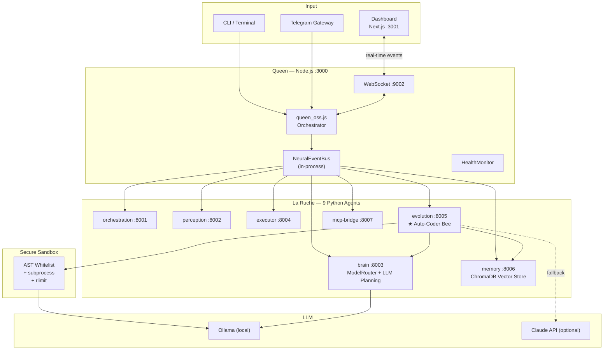

<div align="center">

```
 ██████╗██╗  ██╗██╗███╗   ███╗███████╗██████╗  █████╗
██╔════╝██║  ██║██║████╗ ████║██╔════╝██╔══██╗██╔══██╗
██║     ███████║██║██╔████╔██║█████╗  ██████╔╝███████║
██║     ██╔══██║██║██║╚██╔╝██║██╔══╝  ██╔══██╗██╔══██║
╚██████╗██║  ██║██║██║ ╚═╝ ██║███████╗██║  ██║██║  ██║
 ╚═════╝╚═╝  ╚═╝╚═╝╚═╝     ╚═╝╚══════╝╚═╝  ╚═╝╚═╝  ╚═╝
```

**The Self-Coding Operating Environment**

[](https://github.com/AMFbot-Gz/LaRuche/actions)
[](https://opensource.org/licenses/MIT)
[](https://www.python.org/downloads/)
[](https://nodejs.org/)
[](https://ollama.ai/)
[](https://github.com/AMFbot-Gz/LaRuche/stargazers)

**You describe the task. Chimera writes the code, secures it, executes it, and saves it. 100% local. No cloud. No API key required.**

</div>

---

## Demo

> *What you'd see in a 3-minute live demo:*
>
> 1. `make dev` boots Queen + 9 agents + Dashboard in one terminal
> 2. You type `"Count all .py files modified this week, sort by size"` in the browser
> 3. The Auto-Coder Bee generates Python code via a local LLM (Ollama), validates it through an AST sandbox, executes it in isolation, and streams the result back live
> 4. The skill is saved in `skills/generated/` and persists across reboots
>
> *Full script: [DEMO_SCRIPT.md](DEMO_SCRIPT.md)*

---

## What is Chimera?

- **A cognitive agentic OS** — Queen orchestrator (Node.js) routes natural-language tasks to 9 specialized Python agents that plan, code, execute, and remember.
- **A secure code sandbox** — generated code never runs naked: AST whitelist + subprocess isolation + `rlimit` resource caps, every single time.
- **A self-improving system** — every successful execution is saved as a reusable skill; the Auto-Coder Bee gets smarter with every run.

---

## Architecture



---

## Quick Start

**Prerequisites:** [Ollama](https://ollama.ai/) · Node.js 20+ · Python 3.11+ · pnpm 9+

```bash
git clone https://github.com/AMFbot-Gz/LaRuche chimera
cd chimera && make setup
make dev
```

Open **http://localhost:3001** — dashboard live. Start talking to your OS.

> `make setup` handles `.env` generation, `ollama pull`, and all JS + Python dependency installs in one shot.

---

## Features

| | |
|---|---|
| **Local-first LLM** — Ollama runs entirely on your machine. No telemetry, no subscriptions, no data leaving your disk. | **Secure sandbox** — 5-layer defense: import whitelist, AST analysis, subprocess isolation, rlimit caps, hardened env. |
| **Auto-Coder Bee** — describe a task in plain language, get working Python code in seconds. | **Persistent skills** — every validated execution is saved. Your system accumulates capabilities over time. |
| **Real-time dashboard** — Next.js + Zustand + WebSocket. Watch every agent event stream live in your browser. | **Polyglot monorepo** — Node.js + Python + Turborepo. One `make dev`, everything up. |

---

## LLM Support

| Model | Use case | Pull command |
|-------|----------|-------------|
| `qwen3-coder` | Code generation (default) | `ollama pull qwen3-coder` |
| `llama3.2:3b` | Fast planning, light tasks | `ollama pull llama3.2:3b` |
| `llama3.1:8b` | Complex reasoning | `ollama pull llama3.1:8b` |
| `codellama:7b` | Alternate code model | `ollama pull codellama:7b` |
| Claude API | Optional cloud fallback | Set `ANTHROPIC_API_KEY` in `.env` |

The Brain agent (`ModelRouterService`) auto-selects the right model based on task complexity — simple tasks go to `llama3.2:3b`, code tasks to `qwen3-coder`, critical decisions to Claude if configured.

---

## Available Commands

```bash
make setup        # One-shot: copy .env, pull LLM, install all deps
make dev          # Start Queen + Dashboard + all agents
make test         # Run all 59 tests (Python + Node.js)
make lint         # black + flake8 + eslint
make agents-up    # Start all Python agents only
make agents-down  # Stop all Python agents
make queen        # Start Queen only (:3000)
make dashboard    # Start Dashboard only (:3001)
```

---

## Roadmap

- [x] **Q1 2026 — Alpha** · Queen + 9 agents + Auto-Coder Bee + Secure Sandbox + WebSocket Dashboard + Security Audit #1 + 59 tests
- [ ] **Q2 2026 — Beta** · Audits #2/3/4 (Performance, Reliability, Architecture) · Docker Compose · Telegram Gateway · Community launch
- [ ] **Q3 2026 — V1** · Chimera Cloud (auth + sync + Stripe) · Product Hunt · 200 GitHub stars · Full documentation
- [ ] **Q4 2026 — Scale** · Teams edition · Skills Marketplace · MRR $13K+

---

## Project Structure

```
chimera/
├── apps/
│   ├── queen/          # Node.js orchestrator (:3000)
│   ├── dashboard/      # Next.js 15 real-time dashboard (:3001)
│   └── gateway/        # Telegram, Discord, CLI gateway
├── agents/
│   ├── evolution/      # ★ Auto-Coder Bee — reference agent (:8005)
│   ├── brain/          # LLM planning + model routing (:8003)
│   ├── memory/         # ChromaDB vector store (:8006)
│   ├── orchestration/  # Multi-agent pipeline (:8001)
│   ├── perception/     # Input parsing (:8002)
│   ├── executor/       # System task execution (:8004)
│   └── mcp-bridge/     # MCP protocol (:8007)
├── skills/
│   ├── core/           # Built-in skills
│   └── generated/      # Skills auto-generated by Bee
├── Makefile
└── turbo.json
```

---

## Contributing

Chimera is MIT open source and community-driven. All contributions welcome.

See [CONTRIBUTING.md](CONTRIBUTING.md) for the full guide. The short version:

1. Fork the repo
2. Use `agents/evolution/` as the **reference pattern** for new agents (see [`AGENT_PATTERN.md`](agents/evolution/AGENT_PATTERN.md))
3. Run `make test && make lint` before opening a PR
4. Follow the [Architectural Decisions](.clio_memory.md#7-décisions-architecturales)

---

## License

MIT — do whatever you want, just keep the attribution.

---

<div align="center">

Built by [Wiaam Hadara](https://github.com/AMFbot-Gz) & **Clio** (AI co-founder)

*"Give every developer a cognitive system that thinks, codes, executes, and improves — 100% local, 100% private."*

</div>
